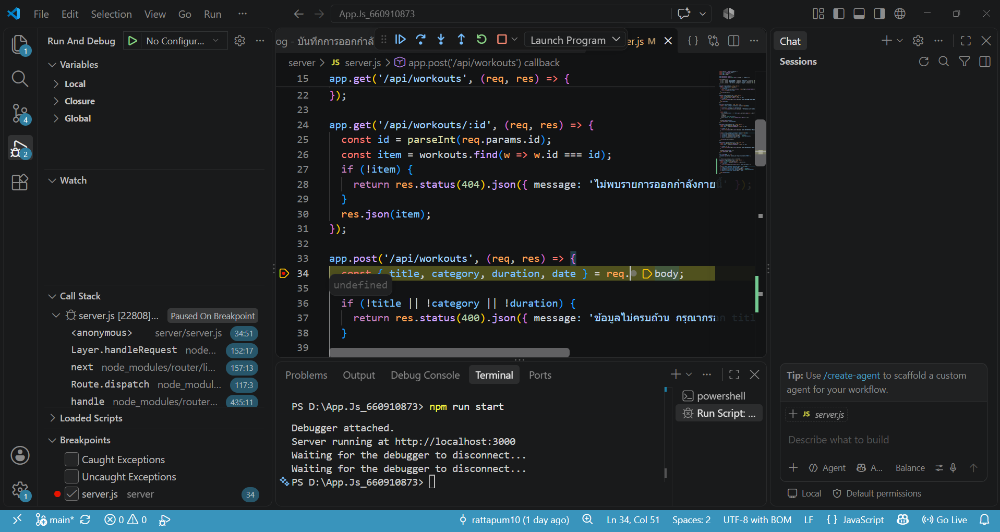
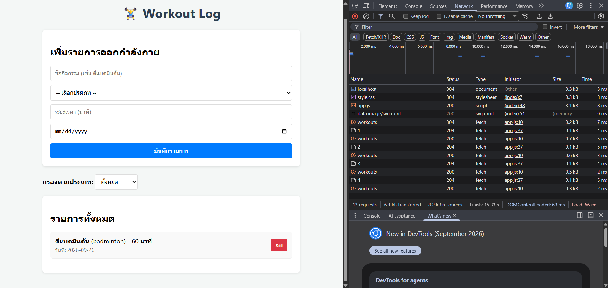

# 🏋️‍♂️ Workout Log Application

แอปพลิเคชันสำหรับบันทึกและจัดการข้อมูลการออกกำลังกาย (Workout Log) พัฒนาด้วย Node.js, Express และ Vanilla JavaScript (HTML/CSS/JS) รองรับการทำงานรูปแบบ CRUD (Create, Read, Delete, Filter) ร่วมกับ REST API

---

## 📁 โครงสร้างโปรเจกต์ (Project Structure)

```text
App.Js_660910873/
├── docs/               # โฟลเดอร์เก็บภาพหลักฐานการดีบัก
│   ├── debug-devtools.png
│   └── debug-vscode.png
├── public/             # ไฟล์ฝั่ง Client (Frontend)
│   ├── app.js
│   ├── index.html
│   └── style.css
├── server/             # ไฟล์ฝั่ง Server (Backend)
│   └── server.js
├── .gitignore
├── package.json
└── README.md
```

---

## 🚀 วิธีการติดตั้งและเริ่มต้นใช้งาน (Installation & Setup)

1. **ติดตั้ง Dependencies ของโปรเจกต์:**
   ```bash
   npm install
   ```

2. **เริ่มต้นรันเซิร์ฟเวอร์ในโหมด Development:**
   ```bash
   npm run dev
   ```
   *(หรือรันผ่านคำสั่ง `npm start`)*

3. **เข้าใช้งานแอปพลิเคชัน:**
   เปิดเว็บเบราว์เซอร์ไปที่ [http://localhost:3000](http://localhost:3000)

---

## 🔗 รายการ REST API Endpoints

| HTTP Method | Endpoint | Description | Request Body / Query String |
| :--- | :--- | :--- | :--- |
| `GET` | `/api/workouts` | ดึงข้อมูลรายการออกกำลังกายทั้งหมด | Query Parameter: `?category=...` (Optional) |
| `GET` | `/api/workouts/:id` | ดึงข้อมูลรายการออกกำลังกายรายบุคคลตาม ID | Params: `id` |
| `POST` | `/api/workouts` | เพิ่มรายการออกกำลังกายใหม่ | Body: `{ "title": "...", "category": "...", "duration": 30, "date": "..." }` |
| `DELETE` | `/api/workouts/:id` | ลบรายการออกกำลังกายตาม ID | Params: `id` |

---

## 📸 หลักฐานการดีบัก (Debugging Evidence)

### 1. VS Code Breakpoint & Debugger
แสดงการตั้งจุด Breakpoint สีแดงที่บรรทัดคำขอ `POST` ในไฟล์ `server.js` และการหยุดทำงานชั่วคราวใน VS Code Debugger เมื่อมี Request ส่งมาจากหน้าเว็บ:



### 2. Browser DevTools Network Tab
แสดงการส่งคำขอ API สำเร็จ (HTTP Status Code `200`, `201`, `204`) ในแท็บ Network ของ Chrome DevTools พร้อมการอัปเดตผลลัพธ์บน UI หน้าเว็บทันที:

